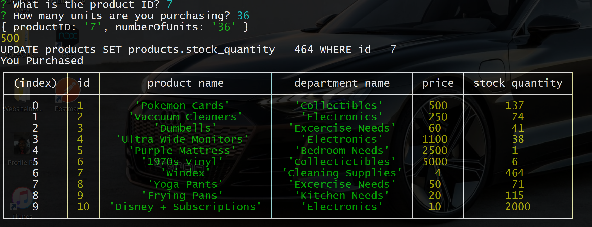

# Bamazon-CLI
### Bamazon CLI is a Node.js command line interface that uses a SQL database for interaction, keeping track of inventory and purchases made by the user. Images below are from the Customer mode withing Bamazon CLI, data tables display inventory prior to and after purchases. 

### Data Table Before Selection

### User Input and Data Table After Selection

